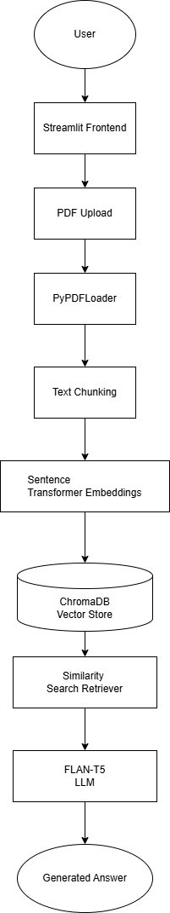
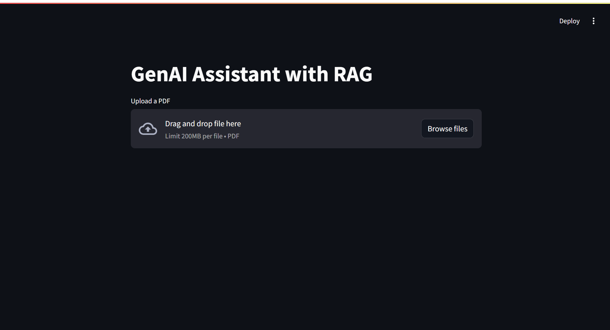
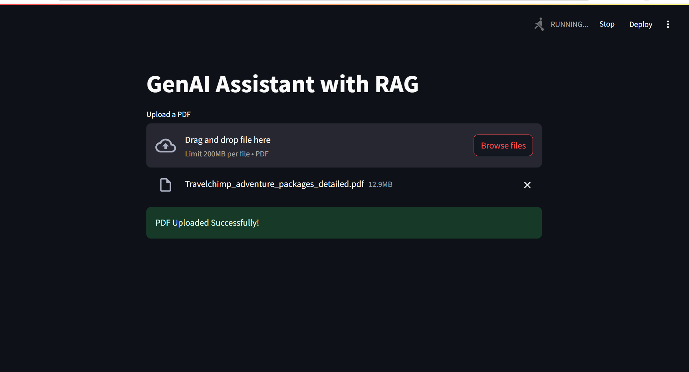
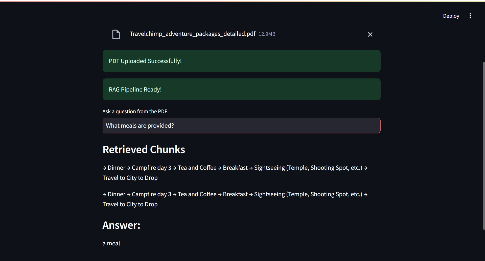
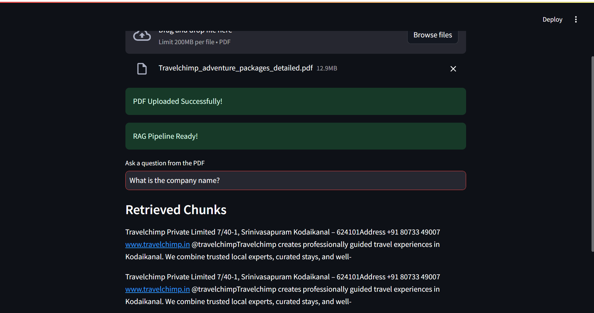
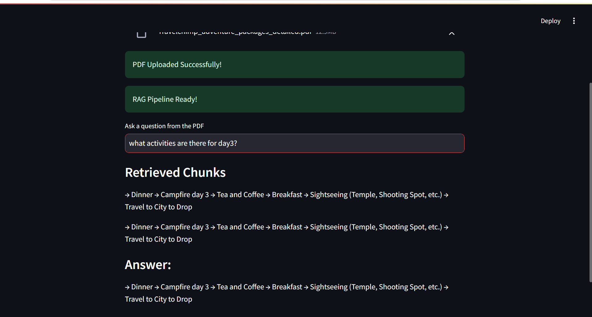

# GenAI RAG Assistant

# GenAI Assistant with RAG

A Retrieval-Augmented Generation (RAG) based GenAI Assistant that allows users to upload PDF documents and ask questions from the uploaded content.

The system retrieves relevant chunks from the PDF using vector embeddings and generates answers using a HuggingFace LLM.

Note:
-Due to API credit limitations, a local HuggingFace model
(google/flan-t5-base) was used instead of OpenAI API.
-Frontend implemented using Streamlit for rapid prototyping.
 Backend modules separated into dedicated Python files.

---

# Features

- Upload PDF documents
- Extract and split document text
- Generate embeddings using Sentence Transformers
- Store embeddings in ChromaDB
- Retrieve relevant chunks using similarity search
- Generate answers using FLAN-T5
- Streamlit-based user interface

---

# Project Structure

```text
project/
│
├── backend/
│   ├── main.py
│   ├── rag.py
│   ├── embeddings.py
│   ├── retrieval.py
│   ├── llm.py
│   ├── storage.py
│   └── docs.json
│
├── frontend/
│   ├── index.html
│   ├── style.css
│   └── script.js
│
├── .env
├── requirements.txt
└── README.md
```

---

## Architecture Diagram



# RAG Workflow Explanation

1. User uploads a PDF document.
2. PDF content is extracted using PyPDFLoader.
3. The extracted text is divided into chunks using RecursiveCharacterTextSplitter.
4. Embeddings are generated using sentence-transformers/all-MiniLM-L6-v2.
5. Embeddings are stored in ChromaDB.
6. When a user asks a question:
   - Similar chunks are retrieved from ChromaDB.
   - Retrieved chunks are passed to the LLM.
   - LLM generates the final response.

---

# Embedding Strategy

The project uses:

```python
sentence-transformers/all-MiniLM-L6-v2
```

Reason:
- Lightweight and fast
- Good semantic similarity performance
- Suitable for local RAG projects

Embeddings convert text chunks into vector representations for semantic search.

---

# Similarity Search Logic

The system uses:

```python
vectorstore.as_retriever(
    search_type="similarity_score_threshold"
)
```

Parameters:
- `k=8`
- `score_threshold=0.5`

This retrieves the most relevant chunks based on semantic similarity between:
- user question
- document embeddings

---

# Prompt Design Reasoning

Custom prompts were used to:
- force the model to answer from retrieved context
- reduce hallucination
- improve answer relevance

Prompt template:

```python
template = """
You are a helpful AI assistant.

Use the retrieved PDF content below to answer the user question.

Context:
{context}

Question:
{question}

Answer:
"""
```

---

# Technologies Used

- Python
- Streamlit
- LangChain
- HuggingFace Transformers
- Sentence Transformers
- ChromaDB
- PyTorch

---

# Setup Instructions

## 1. Clone Repository

```bash
git clone https://github.com/snehithaponnada/genai-rag-assistant
cd genai-rag-assistant
```

## 2. Create Virtual Environment

```bash
python -m venv venv
```

## 3. Activate Environment

### Windows

```bash
venv\Scripts\activate
```

## 4. Install Dependencies

```bash
pip install -r requirements.txt
```

## 5. Run Application

```bash
streamlit run backend/main.py
```

---

# Screenshots

## Home Page


## PDF Upload


## Retrieved Chunks




## Generated Answer
)

---

# Future Improvements

- Use larger LLMs for better answer quality
- Add chat history memory
- Support multiple PDFs
- Add conversational retrieval
- Deploy using HuggingFace Spaces or Render

---

# Author


Snehitha Ponnada


